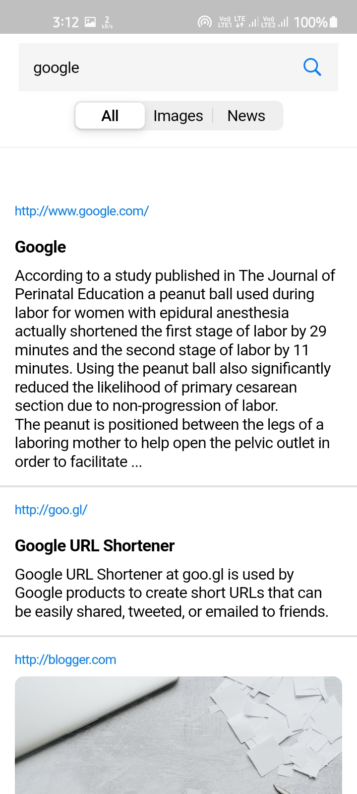
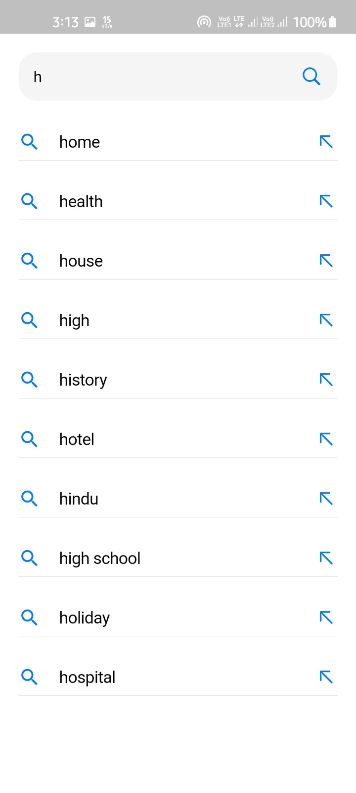

# Google App Clone

## App Features.

Google app clone(ios styled) with websearch api and hive local database.

## App Information

**Packages used:**

- cupertino_icons: ^1.0.2
- dio: ^4.0.0
- provider: ^6.0.1
- url_launcher: ^6.0.12
- hive: ^2.0.4
- hive_flutter: ^1.1.0
- path_provider: ^2.0.5
- cached_network_image: ^3.1.0
- webview_flutter: ^2.1.0
- photo_view: ^0.12.0

<p align="center">







</p>

## How to use

To clone and run this application, you'll need [Git](https://git-scm.com/downloads) and [Flutter](https://flutter.dev/docs/get-started/install) installed on your computer. From your command line:

```
# Clone this repository
$ git clone <url>

# Go into the repository
$ cd <app>

# Install dependencies
$ flutter packages get

<!-- before run the app you need to add api key in lib\repositories\web_repo.dart and lib\screens\recent.dart-->

# Run the app
$ flutter run
```
